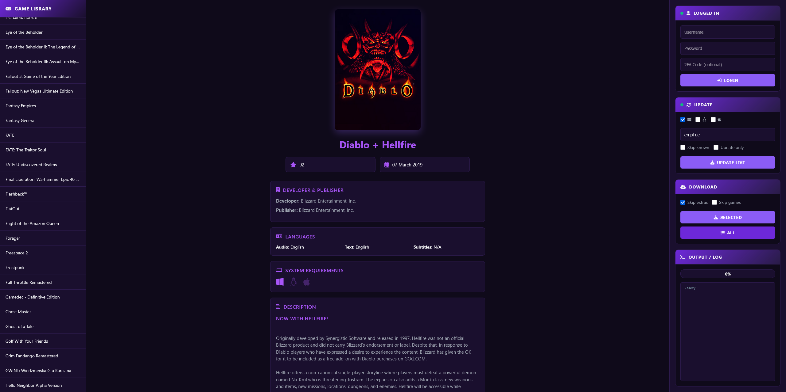
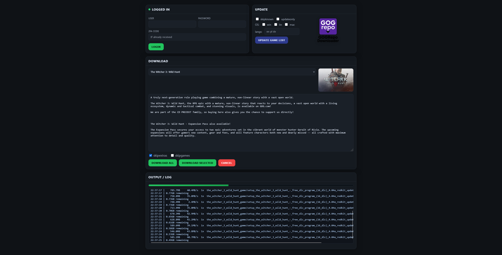
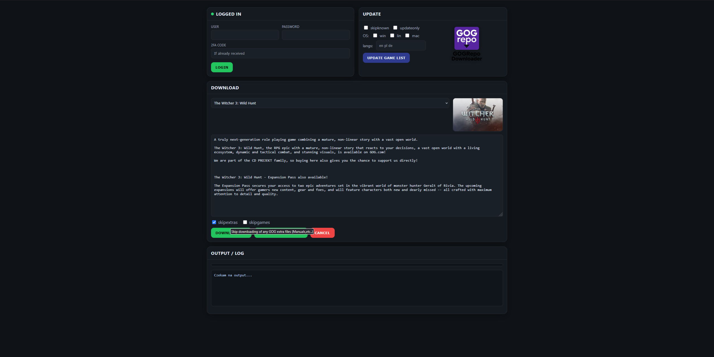

# GOGrepo GUI ✨

<p align="center">
  
</p>

A lightweight Flask-based web UI around gogrepo to log in, update your manifest, and download your GOG library with real-time logs, progress, and inline game info. Designed to be compact, modern, and easy to deploy. 🚀

---

## Screenshots 📸

<p align="center">
  
  
  
</p>

---

## Features ✅

- Two-step login flow integrated with `gogrepo`.  
- Update manifest with OS and language filters, plus:
  - `skipknown` — Only update new games in your library.  
  - `updateonly` — Only update games with the updated tag in your library.  
- Download options:
  - Download all titles, or a single selected game from your library.  
  - Real-time output panel with progress estimation and a Cancel button.  
- Inline game details:
  - Description and cover fetched from GOG API with manifest fallback for robustness.
- Disk cache for descriptions and covers 
  - Stores JSON in Cache/desc and images in Cache/cover to reduce external API calls; cached covers are served locally for faster details panel.
- Helpful hover tooltips on toggles:
  - `skipknown`, `updateonly`, `skipextras`, `skipgames` show what each option does.  

## Roadmap 🗺️

- 2FA improvements:
  - Current status: works with authenticator app codes and accounts without 2FA.
  - Goal: add support for email-based security codes.
- Multi-select downloads:
  - Select several games at once (not just one or all).
- Multi-account sessions:
  - Log into multiple GOG accounts and download without duplicates across libraries.


---

## To build the Docker image locally 🐳

### 1) Clone the repository
Make sure you have the project files locally (the build context must include the `Dockerfile`).  
```
git clone https://github.com/60plus/GOGrepo-GUI.git
cd GOGrepo-GUI
```

### 2) Build a local image
Build directly from the provided Dockerfile in the repo root.  
```
docker build -t gogrepo-gui:latest .
```

### 3) Run with docker run
Run the container binding port 8080 and mounting a local `./data` folder to persist cookies and manifest.  
```
docker run -d --name gogrepo-gui \
  -p 8080:8080 \
  -v "$PWD/data:/app/data" \
  -e FLASK_SECRET_KEY="${FLASK_SECRET_KEY:-change-me}" \
  -e GOGREPO_DATA_DIR="/app/data" \
  -e PYTHON_BIN="python3" \
  --restart unless-stopped \
  gogrepo-gui:latest

```
Open http://localhost:8080 and use the UI; the server binds to 0.0.0.0:8080 and persists data under `/app/data`.


### 4) Portainer Stack (Compose)
Use this minimal Compose spec as a Portainer “Stack” for persistent deployment.  
```
version: "3.9"

services:
  gogrepo-gui:
    image: gogrepo-gui:latest
    container_name: gogrepo-gui
    ports:
      - "8080:8080"
    environment:
      - FLASK_SECRET_KEY=${FLASK_SECRET_KEY:-change-me}
      - GOGREPO_DATA_DIR=/app/data
      - PYTHON_BIN=python3
    volumes:
      - ./data:/app/data
    restart: unless-stopped
    # Optional: run as your host user
    # user: "${UID:-1000}:${GID:-1000}"

```

## Prebuilt Docker Images 🐳

### Prebuilt Docker images are available at:
```
60plus/gogrepo-gui:latest
```

You can run the container directly with Docker:
```
docker run -d --name gogrepo-gui \
  -p 8080:8080 \
  -v "$PWD/data:/app/data" \
  -e FLASK_SECRET_KEY="${FLASK_SECRET_KEY:-change-me}" \
  -e GOGREPO_DATA_DIR="/app/data" \
  -e PYTHON_BIN="python3" \
  --restart unless-stopped \
  60plus/gogrepo-gui:latest

```
Alternatively, you can deploy it easily using Portainer Stack.
Here’s an example stack definition:
```
version: "3.9"

services:
  gogrepo-gui:
    image: 60plus/gogrepo-gui:latest
    container_name: gogrepo-gui
    ports:
      - "8080:8080"
    environment:
      - FLASK_SECRET_KEY=${FLASK_SECRET_KEY:-change-me}
      - GOGREPO_DATA_DIR=/app/data
      - PYTHON_BIN=python3
    volumes:
      - ./data:/app/data
    restart: unless-stopped
    # Optional: run as your host user
    # user: "${UID:-1000}:${GID:-1000}"

```


> [!TIP]
> gogrepo.py in the repository still works on its own and can be used standalone if you prefer.


<details>
<summary>gogrepo.py INFO</summary>
gogrepo
-------


Quick Start -- Typical Use Case
----------------

* Login to GOG and save your login cookie for later commands. Your login/pass can be specified or be prompted. You generally only need to do this once to create a valid gog-cookies.dat

  ``gogrepo.py login``

* Fetch all game and bonus information from GOG for items that you own and save into a local manifest file. Run this whenever you want to discover newly added games or game updates.

  ``gogrepo.py update -os windows linux mac -lang en de fr``

* Download the games and bonus files for the OS and languages you want for all items known from the saved manifest file.

  ``gogrepo.py download``

* Verify and report integrity of all downloaded files. Does MD5, zip integrity, and expected filesize verification. This makes sure your game files can actually be read back and are healthy.

  ``gogrepo.py verify``

Advanced Usage -- Common Tasks
----------------

* Add new games from your library to the manifest.

  ``gogrepo.py update -os windows -lang en de -skipknown``

* Update games with the updated tag in your libary.

  ``gogrepo.py update -os windows -lang en de -updateonly``

* Update a single game in your manifest.

  ``gogrepo.py update -os windows -lang en de -id trine_2_complete_story``

* Download a single game in your manifest.

  ``gogrepo.py download -id trine_2_complete_story``

Commands
--------

``gogrepo.py login`` Authenticate with GOG and save the cookie locally in gog-cookies.dat file. This is needed to do
update or download command. Run this once first before doing update and download.

    login [-h] [username] [password]
    -h, --help  show this help message and exit
    username    GOG username/email
    password    GOG password

--

``gogrepo.py update`` Fetch game data and information from GOG.com for the specified operating systems and languages. This collects file game titles, download links, serial numbers, MD5/filesize data and saves the data locally in a manifest file. Manifest is saved in a gog-manifest.dat file

    update [-h] [-os [OS [OS ...]]] [-lang [LANG [LANG ...]]] [-skipknown | -updateonly | -id <title>]
    -h, --help            show this help message and exit
    -os [OS [OS ...]]     operating system(s) (ex. windows linux mac)
    -lang [LANG [LANG ...]]  game language(s) (ex. en fr de)
    -skipknown            only update new games in your library
    -updateonly           only update games with the updated tag in your library
    -id <title>           specify the game to update by 'title' from the manifest
                          <title> can be found in the !info.txt of the game directory

--

``gogrepo.py download`` Use the saved manifest file from an update command, and download all known game items and bonus files.

    download [-h] [-dryrun] [-skipextras] [-skipextras] [-skipgames] [-wait WAIT] [-id <title>] [savedir]
    -h, --help   show this help message and exit
    -dryrun      display, but skip downloading of any files
    -skipextras  skip downloading of any GOG extra files
    -skipgames   skip downloading of any GOG game files
    -wait WAIT   wait this long in hours before starting
    -id <title>  specify the game to download by 'title' from the manifest
                 <title> can be found in the !info.txt of the game directory
    savedir      directory to save downloads to

--

``gogrepo.py verify`` Check all your game files against the save manifest data, and verify MD5, zip integrity, and
expected file size. Any missing or corrupt files will be reported.

    verify [-h] [-skipmd5] [-skipsize] [-skipzip] [-delete] [gamedir]
    gamedir     directory containing games to verify
    -h, --help  show this help message and exit
    -skipmd5    do not perform MD5 check
    -skipsize   do not perform size check
    -skipzip    do not perform zip integrity check
    -delete     delete any files which fail integrity test

--

``gogrepo.py import`` Search an already existing GOG collection for game item/files, and import them to your
new GOG folder with clean game directory names and file names as GOG has them named on their servers.

    import [-h] src_dir dest_dir
    src_dir     source directory to import games from
    dest_dir    directory to copy and name imported files to
    -h, --help  show this help message and exit

--

``gogrepo.py backup`` Make copies of all known files in manifest file from a source directory to a backup destination directory. Useful for cleaning out older files from your GOG collection.

    backup [-h] src_dir dest_dir
    src_dir     source directory containing gog items
    dest_dir    destination directory to backup files to
    -h, --help  show this help message and exit


Requirements
------------
* Python 2.7 (Python 3 support coming soon)
* html5lib 0.99999 (https://github.com/html5lib/html5lib-python)
* html2text 2015.6.21 (https://pypi.python.org/pypi/html2text) (optional, used for prettying up gog game changelog html)

I recommend you use `pip` to install the above python modules. 

  ``pip install html5lib html2text``

</details>
